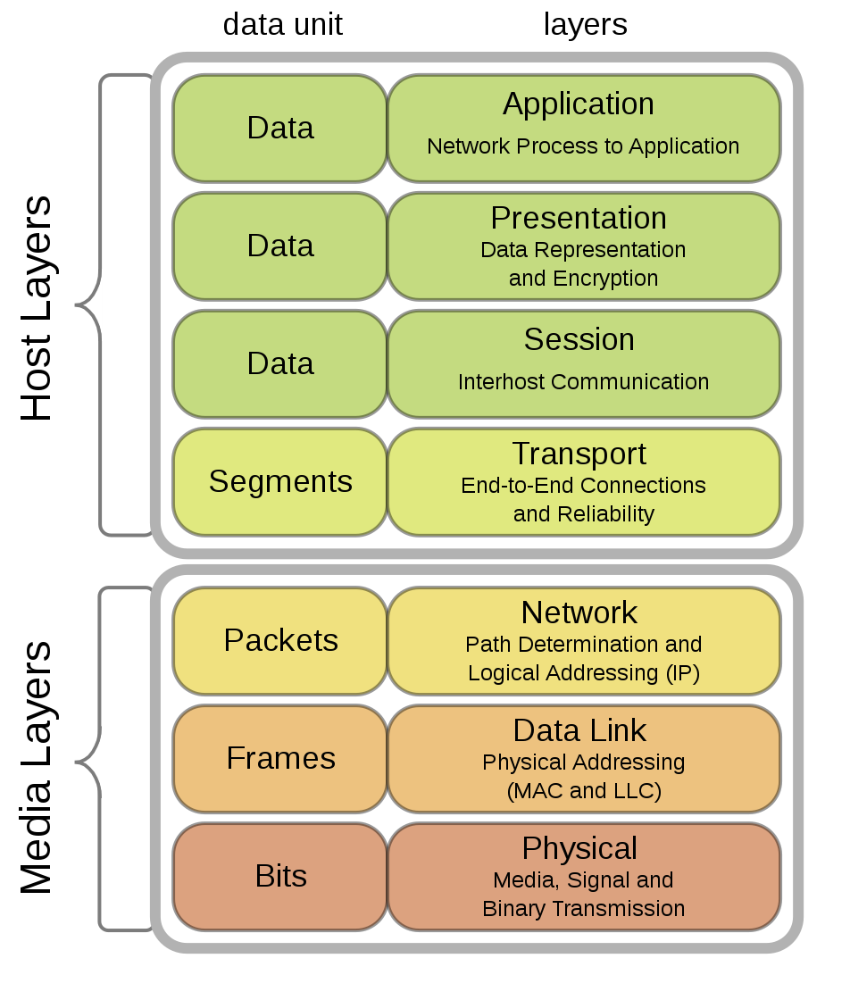

# 1. Mạng máy tính là gì ?
- Mạng máy tính là một nhóm các máy tính, thiết bị ngoại vi được **kết nối** với nhau thông qua các phương tiện truyền dẫn như cáp, sóng điện từ, tia hồng ngoại… để **chia sẻ(share)** tài nguyên, dữ liệu.
  
# 2. Tác động của các ứng dụng người dùng trên mạng:
- Ứng dùng hàng loạt :
  - FTP (chia sẽ file), TFTP,..
- Ứng dụng tương tác:
  - Tương tác giữa người và máy
  - Quan trọng thời gian đáp ứng 
- Ứng dụng thời gian thực
  - VoIP, Video
  
# 3. Phân loại mạng máy tính:
- Theo khoảng cách địa lý:
  - Mạng cục bộ (LAN)
  - Mạng địa phương (MAN)
  - Mạng diện rộng (WAN)
  - Mạng toàn cầu (INTERNET)
- Theo kỹ thuật truyền tin:
  - Point - to - Point 
  - Broadcast 
- Theo mục đích người sử dụng:
  - Peer - to - Peer
  - Client-Server
  - ...

# 4. Đặc điểm của mạng 
- Tốc độ
- Tốc độ
- Chi phí
- An ninh
- Sẵn sàng
- Khả năng mở rộng
- Độ tin cậy
- Sơ đồ liên kết mạng

# 5. Đường truyền mạng 
- Vật lý:
  - Cáp xoắn
  - Cáp đồng trục
  - Cáp quang
  - Sóng radio

# 5. Các giao thức mạng:
- FTP (File transfer Protocol): Giao thức truyền tệp cho phép người dùng lấy hoặc gửi tệp tới một máy khác.
- Telnet: Chương trình mô phỏng thiết bị đầu cuối cho phép người dùng login vào một máy chủ từ một máy tính nào đó trên mạng.
- SMTP (Simple Mail Transfer Protocol): Một giao thức thư tín điện tử.
DNS (Domain Name server): Dịch vụ tên miền cho phép nhận ra máy tính từ một tên miền thay cho chuỗi địa chỉ Internet khó nhớ.
- SNMP (Simple Network Monitoring Protocol): Giao thức quản trị mạng cung cấp những công cụ quản trị mạng từ xa.
- RIP (Routing Internet Protocol): Giao thức dẫn đường  động.
- ICMP  (Internet Control Message Protocol): Nghi thức thông báo lỗi. 
- UDP (User Datagram Protocol): Giao thức truyền không kết nối cung cấp dịch vụ truyền không tin cậy nhưng tiết kiệm chi phí truyền.
- Hyper Text Transfer Protocol : chuẩn để truyền các siêu văn bản trên Web. HTTP hoạt động gần giống FTP nhưng không duy trì kết nối truyền lệnh, kênh truyền dữ liệu được thiết lập và giải phóng ngay sau khi tài liệu được truyền - nhận

# 6. Mô hình OSI

