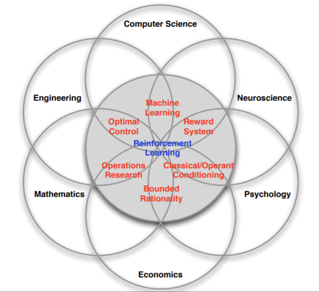
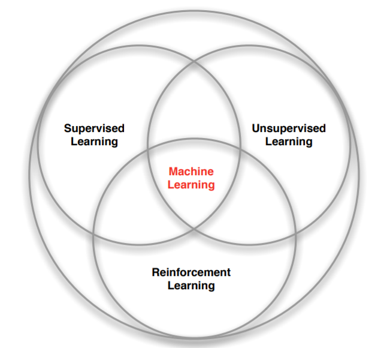

# 1. Giới thiệu
-   Hôm nay mình sẽ bắt đầu nghiên cứu về một lĩnh vực khác của trí tuệ nhân tạo (AI), như tiêu đề đó là Reinforcement Learning (Học cũng cố). 

-   Nhắc lại một tí về **machine learning**, chúng ta có thể phân chia các thuật toán machine learning thành 3 dạng chính:

    -   __Supervised learning__(Học có giám sát): Nhóm các thuật toán dự đoán đầu ra (outcome) từ dữ liệu (income) dựa trên bộ dữ liệu (income, outcome) cho trước:
        -    Dự đoán giá nhà : income = diện tích , outcome = giá
        -    Nhận diễn chữ viết tay: income = ảnh , outcome = số báo nhiêu
    -   __Unsupervised learning__(Học không giám sát): Nhóm các thuật toán học cấu trúc của dữ liệu income từ đó suy ra outcome (không biết trước outcome):
        -   Phân loại khác hàng: Income = {giá hàng hóa khác mua, tỉ lệ quay lại mua hàng}  outcome = Nhóm khách hàng(tiềm năng, không tiềm năng)
    -  __Reinforcement learning__ (Học cũng cố - RL): Chúng ta có thể mô tả RL một cách đơn giản : __"Trial - Error",__ dễ hiểu hơn ta có thể liên tưởng đến câu nói "Còn chơi là con gỡ". RL liên tục thử các hành động (action) để tiềm ra action tối ưu nhất để giải quyết vấn đề. Ta sẽ nói rõ hơn ở các bài sau 
# 2. Ứng dụng của Reinforcement Learning
-   Nhắc đến RF thường thì người ta sẽ nhắc ngay đến Robot: Như Robot dẫn đường , Robot chăm sóc người bệnh,...
-   RF còn có thể áp dụng để huấn luyện máy tính chơi, giải các trò chơi như cờ vua, cờ tướng, mario,..
-  Ngoài ra RF còn được áp dụng trong nhiều lĩnh vực khác như Trading, Engineering, NLP,... 

# 3. Tổng kết 
- OK bây giờ chúng ta đã có một cái nhìn sơ lược về deeplearning. Từ bài sau chúng ta sẽ đi thẳng vào RF nhé.